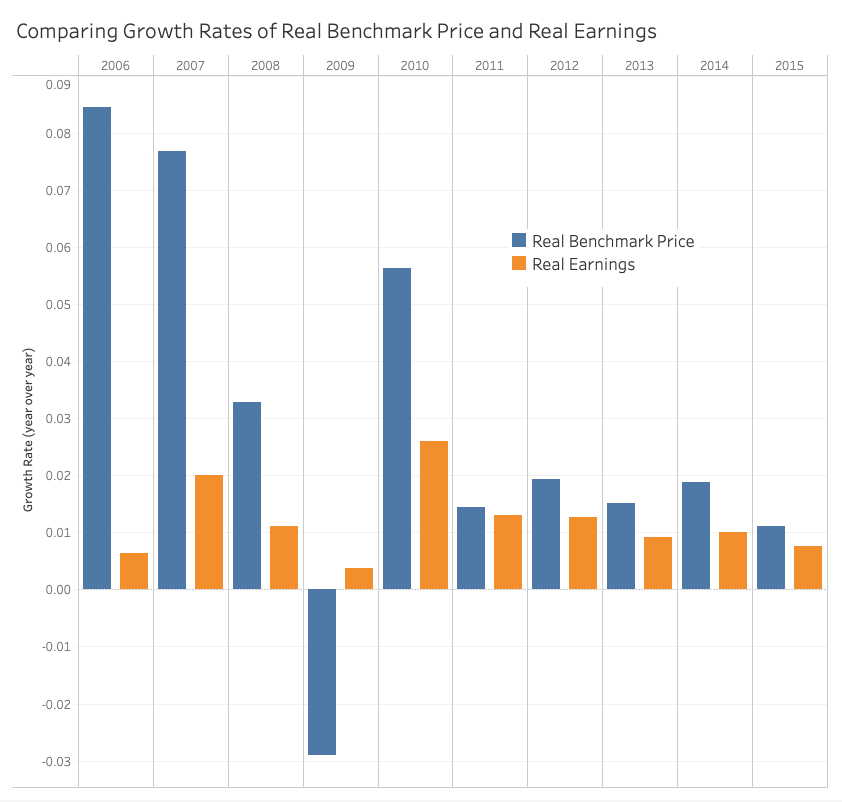

# Canadian Housing Market Analysis

This project involves a comprehensive analysis of the Canadian housing market using datasets from the Canadian Open Data portal. The data covers various aspects of the housing market, including weekly earnings, housing construction, house prices, and consumer index trends.

## Datasets

The following datasets were used for this analysis and are available for download [in this folder](/data/).

- Weekly earnings from 1.1.2001 to 15.4.2015 (`weekly_earnings.csv`)
- Housing constructions from 1955 to 2019 (`real_estate_numbers.csv`)
- House prices from 1.1.2005 to 1.9.2020 (`real_estate_prices.xlsx`)
- Housing_price_index from November 1979 to September 2020 (`housing_price_index.csv`)
- Office_realestate_index from November 1979 to September 2020 (`office_realestate_index.csv`)
- Consumer index from November 1979 to September 2020 (`consumer_index.csv`)

## Process

- Use Python and/or Excel to parse data, format and filter in preparation for Tableau
- Load data into Tableau
- Set up table connections in Tableau
- EDA in Tableau guided by analysis tasks
- Refine Tableau visualizations to optimize comprehension
- Group Tableau worksheets into comprehensive dashboards

## Analysis Tasks and Visualizations

&nbsp;

### House Prices Trend Analysis
Visualization of the trend of house prices across Canada in the last 40 years.

- We can see from 40 years of HPI data that housing prices have increased steadily but relatively linearly since 1981.
- The lower figure shows that the rate of growth has remained extremely stable when viewed at this timeframe. The trend line for growth rate has m value of 0.00016, illustrating how slowly the rate is increasing.) 

&nbsp;

### Trends in Benchmark Housing Price vs HPI
Comparison of the trend after 2005 with actual benchmark prices.

- Can see that Benchmark Housing Price and HPI are very closely correlated. We shouldn't be too amazed, since the Benchmark price is calculated using the HPI. Making this a fairly meaningless comparison.

&nbsp;

### Office vs. House Prices Trend
Analysis of the trend of office prices versus house prices.

- We can clearly see that office and home indices follow roughly the same trends, and are positively correlated.
- Following 2008 (what could have possibly occured!?), the growth rate of housing prices has heavily outpaced office prices.
- From 2016 to 2017 housing prices grew **5x** faster than office prices (13.0% and 2.5%, respectively).

&nbsp;

### Heatmap: 2017 Benchmark Prices by Region
A heatmap showing current house prices for each available district in Canada.

- From this heatmap we can see there is a large variance in the benchmark home cost depending on region.
- There are clearly hotspots in both the Toronto and Vancouver metro areas.
- Outside of hotspots, the majority of regions have still experienced significant benchmark price increases over this 15 year period.

&nbsp;

### District Price Differences
Visualization showing if the price differences between different districts are increasing.

- From this boxplot, we can clearly see that the variance in regional benchmark housing costs increased rapidly between 2005 and 2020.
- In 2005, the highest regional benchmark (Vancouver, $400K) was less than 4x the lowest benchmark (Regina, $112K).
- In 2018, the highest regional benchmark (Vancouver, $1071K) was more than 5x the lowest (Moncton, $178K).
- All outliers are high outliers. Intuitively, these outliers seem crucial to our analysis, as they are overrepresented by denser population centers, and are likely to provide lots of explanatory power for aggregate/national trends.

&nbsp;

### House Prices vs. Earnings Trend
Comparison of the trend of house prices with earnings.

- Note: The explanatory power of this figure is reduced due to the limited date-range overlap between data sources
- From this limited range we can still see a clear trend where the growth in housing prices outpaces earnings in every year except for 2009 (which, by the way, is the year after 2008).

&nbsp;

### Earnings and House Affordability Analysis
Analysis to answer the question: "Did people spent more of their earnings in 2014 than they did in 2001?"
- Given available data, we will determine this by first converting weekly earnings data and benchmark prices to real values using CPI. This will allow us to see how earning power keeps up with inflation.

- This Table supports the nominal comparison in the previous section, showing that there is still a clear trend of housing costs outpacing earnings.
- This analysis is a compromise, as we lack consumer spending data outside of CPI values, and the data for benchmark home prices only starts in 2005, we have to extrapolate backwards to 2001.

- We can get more insight into how earning and housing costs interact by charting the number of years it takes to earn the benchmark price on the weekly average earnings.
- Given the following assumptions: (1) renting price correlate positively with house price, (2) morgage rate and length is constant, (3) consumer behavior is constant, we can determine from this data that people must be spending more of their earnings in 2014 than in 2005 (and 2001 by extrapolation), due to the cost of housing outpacing their earnings.

&nbsp;

### Economic Crises Impact
Visualization showing the effect of economic crises on earnings, house prices, office prices, house constructions, and consumer index.

- The effect of the 07/08 financial crisis is on display in every metric available in the data.
- You can clearly see that the reduction in growth reaching its peak in 2009.
- Most prominently, we can see a 30% drop in housing constructions in 2009 compared to the previous year.

- Too zoom out to view previous economic crises, we need to drop a few metrics are missing from this period.
- Here we can see that the year following the 1987 stock market crash had a large impact on construction starts, with negligible impact on consumer prices and office prices.

- Here we can see that the 1990-1992 recession has a huge impact on the growth rate of consumer prices and office prices. Prices reaching a local minimum in 1992 could hint to why construction starts actually increased this year.

- The Dotcom Crash has a comparatively tame impact on our metrics. Changes to consumer and office prices are negligible, while growth in new construction decreased by a factor of 5.

&nbsp;

### CPI and HPI Regression Analysis
Scatter plot of consumer_index with housing_price_index and the fitted regression line between them. Data points have been grouped by color into 3 periods (2005-2009, 2010-2015, 2016-2020).

- We can see a moderate positive correlation between CPI and HPI
- Given the larger R-Squared (0.6) and small P-value (< 0.0001), we can see that this regression is both statistically significant, as well as a strong predictor.
- Conlusion: we can use CPI to predict HPI, and vice versa. 

&nbsp;

### Scatter Matrix of Greater Vancouvers Benchmark Price Trends By Property Type
A matrix of scatter plots comparing the benchmark prices, for each month between 2005-2020. Every combination of property type is compared, with a regression trendline. Axes are normalized to allow direct cross-comparison.

- We can determine a number of different trends from this matrix.
- By following the diagonal, we can see the relative price position and growth range for each dwelling type.
    - In the bottom-right corner can see that Two Storey prices have experienced the most change (widest range) of any dwelling type.
    - In the top-left we can see apartments have experienced the least price change (followed by townhouses)
- By looking across a row, we can check the slope of each trendline to determine how closely one property type approximates the the type in that row.
    - Apartments are most closely correlated with townhouses.
    - One Storey, Two Storey, and Single Family homes are all closely correlated.
    - Two Storey homes and Apartments have the largest difference between them.
        - The slope of the trendline of Two Storey vs Apartment (bottom-left table) has a coefficient of 2.6. Meaning that for every $1000 increase in benchmark apartment price, two storey homes will, on average, experience $2600 in valuation.

## Challenges
- Each source of data had its own temporal range, complicating comparisons and limiting the analysis.
- The data contains multiple Index baselines that must be navigated in order to not misrepresent relationships between data.
- Showing geographic data for Canadian regions is extremely limited by Tableaus default region mapping.
- The data lacked standard indexes e.g., "CPI Total", requiring the use of alternative metrics e.g., "(CPI) excluding the effect of indirect taxes"
- Accurate insights were complicated by the need to caclulate real values from nominal, since the data spans decades.
- Region data had no set level of detail, and including city, county, province, and district entites, making the process of geographic analysis and visualization prohibitively complex.

## Future Goals
- If more time was available, I would like to spend the time to set up each available region into Tableaus geographic mapping to allow for a shaded area mapping.

---

